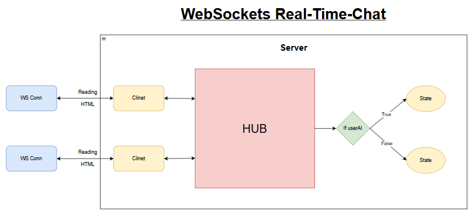

# Real-Time Chat

A real-time web chat application. It supports multiple chat rooms, WebSocket-based communication, and optional AI responses powered by Google Gemini.

---



---

## Features

### Features
- Real-time messaging using WebSockets.
- Multiple chat rooms with dynamic creation.
- Usernames per session.
- Optional AI assistant (Gemini) that replies to messages.
- HTML templates for UI rendering.
- Environment-based configuration using .env.

---

## Architecture

This project follows a clean and structured architecture for maintainability and scalability.

```
├── cmd/web/
│   ├── assets/        # Static files (CSS, JS)
│   ├── index.html     # Home page
│   └── chat.html      # Chat UI
config/
│   └── config.go     ← διαβάζει .env, επιστρέφει Config struct  
├── internal/server/
│   ├── client.go      # WebSocket client logic and  Gemini AI integration
│   └── room.go        # Chat room management
├── main.go            # Application entry point
├── go.mod
├── go.sum
└── .env
```

---

### Requirements
- Go 1.24+
- Google Gemini API key.

---

### Setup
1) Clone:
```bash
git clone https://github.com/vrstelios/RealTimeChat.git
cd RealTimeChat
```
2) Environment:

The site [Gemini](https://ai.google.dev/gemini-api/docs/api-key?utm_source=google&utm_medium=cpc&utm_campaign=Cloud-SS-DR-AIS-FY26-global-gsem-1713578&utm_content=text-ad&utm_term=KW_gemini%20api%20key&gclsrc=aw.ds&gad_source=1&gad_campaignid=23417416058&gclid=EAIaIQobChMItJLi5LuhkgMVUqf9BR2YQDzhEAAYASABEgJYQfD_BwE) takes a correct API key.
Create a `.env` in the project root:
```bash
APP_ADDR=:8080
GEMINI_API_KEY=your_gemini_api_key_here
```
3) Dependencies (if needed):
```bash
go mod tidy
```

### Run
```bash
go run .
```
You will be prompted for a city, then the current weather data prints out.

---

### Usage
Enter a room name and username.
1. Join the room.
2. Start chatting in real time with other users.
3. To enable AI responses, join the room with `useAI=true`.
4. Send messages starting with `AI` to interact with Gemini.

### Author
[DoctorVerRossi](https://github.com/vrstelios)

---

If you find this project helpful, please give it a star on GitHub!

